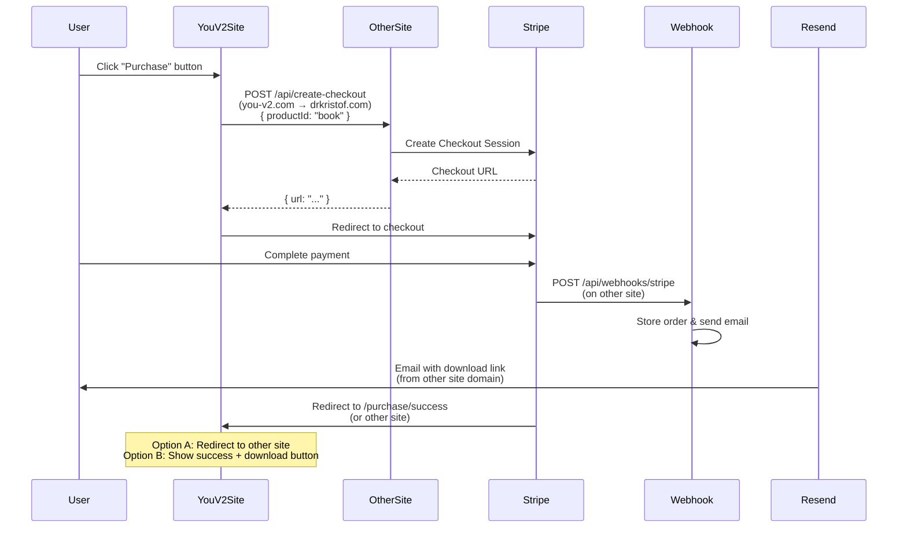

# Upgrade Book Download to Purchase Flow (Frontend-Only)

## Current State Analysis

The site currently has a **free ebook download** flow:

- **Component**: [`src/components/ebook-modal.tsx`](src/components/ebook-modal.tsx) - collects email via Formspree
- **Flow**: User enters email → Formspree submission → success message
- **No payment processing** - completely free
- **No API routes** - no backend infrastructure

## Target State

Upgrade to a **paid purchase flow** by routing backend calls to the existing other website:

- Frontend calls other site's `/api/create-checkout` endpoint
- Stripe Checkout handles payment (same as other site)
- Success page redirects to other site or calls their download API
- All backend processing (webhooks, email, downloads) handled by other site
- **No backend code needed on this site**

## Implementation Plan

### 1. Update Ebook Modal Component

**File**: [`src/components/ebook-modal.tsx`](src/components/ebook-modal.tsx)**Changes:**

- **Remove** Formspree email collection form
- **Replace** `handleSubmit` with `handlePurchase` function:
- POST to `https://drkristof.com/api/create-checkout` (or other site URL) with `{ productId: "book" }`
- Redirect user to Stripe checkout URL on success
- Show loading state during request
- Handle errors gracefully
- **Keep** book cover/contents preview UI (already good)
- **Update** button text to "Purchase" or "Buy Now" (via translations)
- **Remove** email input field (Stripe Checkout collects email)

**Key code change:**

```typescript
const handlePurchase = async () => {
  setIsLoading(true)
  try {
    const response = await fetch("https://drkristof.com/api/create-checkout", {
      method: "POST",
      headers: { "Content-Type": "application/json" },
      body: JSON.stringify({ productId: "book" }),
    })
    const data = await response.json()
    if (data.url) {
      window.location.href = data.url  // Redirects to Stripe
    }
  } catch (error) {
    // Handle error
  } finally {
    setIsLoading(false)
  }
}
```


### 2. Create Success Page (Optional)

**File**: `src/app/purchase/success/page.tsx`**Two options:Option A: Redirect to other site's success page**

- Extract `order_id` from URL query params
- Redirect to `https://drkristof.com/purchase/success?order_id={orderId}`
- Simple pass-through

**Option B: Stay on this site, call other site's download API**

- Extract `order_id` from URL query params
- Display success message
- Download button calls `https://drkristof.com/api/download/{orderId}`
- Handle loading and error states

**Recommendation**: Option A is simpler and keeps the experience consistent. Users get the download link via email anyway.

### 3. Update Translations

**Files**: [`src/translations/en.json`](src/translations/en.json) and [`src/translations/ru.json`](src/translations/ru.json)**Changes:**

- Update `ebook.submit` from "Send me the book" to "Purchase" / "Buy Now"
- Update `ebook.description` to mention price (e.g., "Get my actionable guide for $9")
- Update `cta.downloadEbook` to "Purchase Book" or "Buy The Soul Code"
- Remove or update `cta.downloadEbookSuccess` (not needed if redirecting to other site)

**Example additions:**

```json
{
  "ebook": {
    "title": "The Soul Code: Rewriting The Patterns That Run Your Life",
    "description": "Get my actionable guide to subconscious change for $9. No spam, just real value.",
    "submit": "Purchase for $9",
    "cancel": "Cancel"
  }
}
```


### 4. Verify CORS Configuration

**Action Required:**

- Ensure the other website's `/api/create-checkout` endpoint allows CORS requests from this domain
- If CORS is not configured, coordinate with backend team to add:
- `Access-Control-Allow-Origin: https://you-v2.com` (this site's domain)
- `Access-Control-Allow-Methods: POST`
- `Access-Control-Allow-Headers: Content-Type`

**Alternative**: If CORS is an issue, could proxy through a Next.js API route, but that defeats the purpose of minimal changes.

### 5. Update Stripe Checkout URLs (On Other Site)

**Action Required on Other Site:**

- Update Stripe Checkout Session success URL to point to this site if desired:
- Current: `https://drkristof.com/purchase/success?order_id={orderId}`
- New: `https://you-v2.com/purchase/success?order_id={orderId}` (if using Option B)
- Or keep redirecting to other site (simpler, Option A)

## Flow Diagram




## What We're NOT Building

Since we're routing through the other website, we **don't need**:

- ❌ Stripe or Resend packages
- ❌ API routes (`/api/create-checkout`, `/api/webhooks/stripe`, `/api/send-email`, `/api/download`)
- ❌ Product configuration file
- ❌ Order store
- ❌ Environment variables (STRIPE_SECRET_KEY, RESEND_API_KEY, etc.)
- ❌ PDF file storage on this site
- ❌ Webhook configuration

All of this is handled by the other website.

## Implementation Checklist

1. ✅ Update `ebook-modal.tsx` to call other site's API
2. ✅ Create success page (redirect or download button)
3. ✅ Update translations for purchase flow
4. ✅ Verify CORS allows requests from this domain
5. ✅ Test end-to-end flow (test mode first)
6. ✅ Update analytics tracking (if needed)

## Testing

1. **Test Mode**: Use Stripe test keys on other site first
2. **CORS**: Verify cross-origin requests work
3. **Flow**: Test complete purchase flow from button click to download
4. **Error Handling**: Test error cases (network failures, invalid responses)

## Migration Notes

- **Backward compatibility**: Old Formspree flow removed entirely
- **Analytics**: Update `trackEvent` calls to track purchase events
- **No breaking changes**: This is a complete replacement, not a migration

## Benefits of This Approach

1. **Minimal code changes** - Only frontend component updates
2. **No backend maintenance** - All backend logic stays on other site
3. **Single source of truth** - One backend to maintain and update
4. **Faster implementation** - No API routes, dependencies, or env vars needed